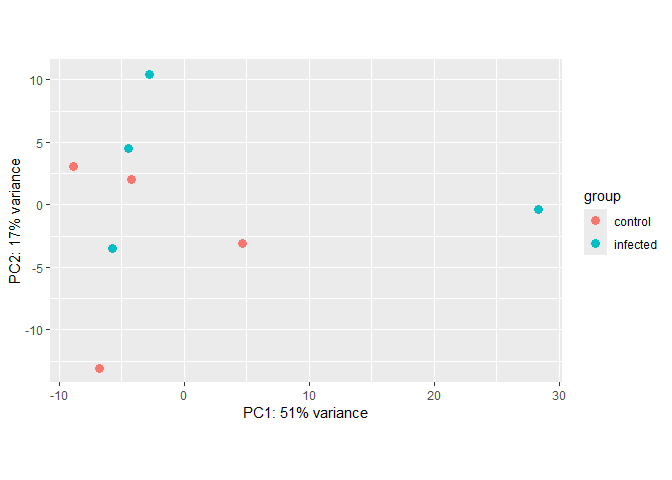
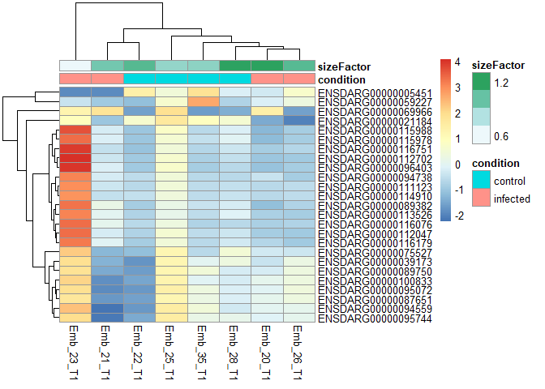
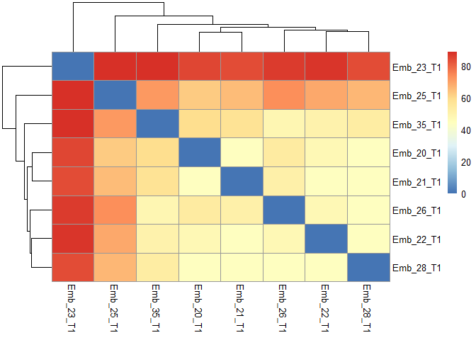
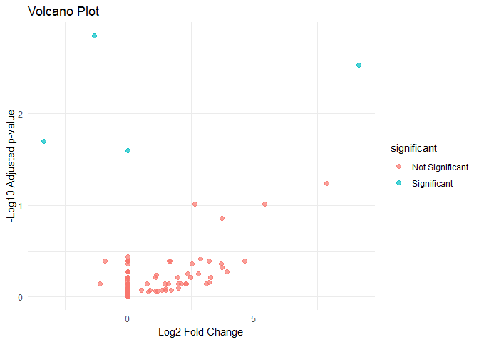
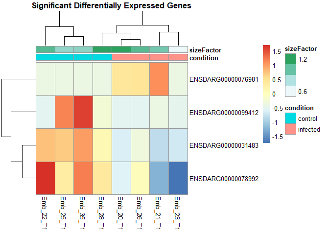

TFM - Differentially expressed mRNA in zebrafish (Danio rerio) embryos
and its correlation with immune inheritance from parents
================
Marc Ferrer Vidal
2026-06-02

``` r
#Creamos el entorno primeramente con los paquetes necesarios que nos pueden hacer falta. Como vamos a llevar a cabo el análisis con DESeq2, los paquetes principales 

if (!requireNamespace("BiocManager")) install.packages("BiocManager")

BiocManager::install(c(
  "Rsubread",
  "SummarizedExperiment",
  "dplyr",
  "DESeq2", "Rsamtools", "pheatmap", "ggplot2","matrixStats","apeglm","clusterProfiler","org.Dr.eg.db","AnnotationDbi","tidyr", "openxlsx"
), ask = FALSE)
```

    ## 
    ##   There is a binary version available but the source version is later:
    ##      binary source needs_compilation
    ## xfun   0.57   0.58              TRUE
    ## 
    ##   Binaries will be installed
    ## package 'gdtools' successfully unpacked and MD5 sums checked

    ## package 'igraph' successfully unpacked and MD5 sums checked

    ## package 'mvtnorm' successfully unpacked and MD5 sums checked

    ## package 'RSQLite' successfully unpacked and MD5 sums checked

    ## package 'xfun' successfully unpacked and MD5 sums checked

    ## 
    ## The downloaded binary packages are in
    ##  C:\Users\Usuario\AppData\Local\Temp\Rtmp4Sqjl0\downloaded_packages

``` r
library(Rsubread)
library(SummarizedExperiment)
library(dplyr)
library(DESeq2)
library(Rsamtools)
library (pheatmap)
library (ggplot2)
library(matrixStats)
library(apeglm)
library(clusterProfiler)
library(org.Dr.eg.db)
library(AnnotationDbi)
library(tidyr)
library(openxlsx)
```

``` r
#Definimos los direcorios donde estan ubicados los datasets tanto de control como de infección y cargamos los datos FASTQ comprimidos y creamos un vector con todos los datos

base_dir <- "C:/TFM"
data_dir <- file.path(base_dir, "Datos TFM")

control_dir <- file.path(data_dir, "Control Embryos")
infect_dir  <- file.path(data_dir, "Infection Embryos")


# Listar todos los FASTQ en subcarpetas
all_files <- c(
  list.files(control_dir, full.names = TRUE, recursive = TRUE),
  list.files(infect_dir,  full.names = TRUE, recursive = TRUE)
)

all_files <- all_files[grepl("\\.fq\\.gz$|\\.fq$", all_files)]
```

``` r
#Unificamos las muestras juntando L5+ L6 + L7 como un solo embrión
get_sample_name <- function(filepath) {
  basename(dirname(filepath))
}
#Separamos R1 y R2 como cadena forward y reverse
R1 <- all_files[grepl("_1\\.fq", all_files)]
R2 <- all_files[grepl("_2\\.fq", all_files)]

stopifnot(length(R1) == length(R2))
```

``` r
#Creamos la matriz con metadatos
samples_raw <- data.frame(
  sample_id = sapply(R1, get_sample_name),
  condition = ifelse(
    grepl("Control Embryos", R1),
    "control",
    "infected"
  ),
  R1 = R1,
  R2 = R2,
  stringsAsFactors = FALSE
)

#Agrupamos las lanes
samples <- samples_raw %>%
  group_by(sample_id, condition) %>%
  summarise(
    R1 = list(R1),
    R2 = list(R2),
    .groups = "drop"
  )

print(samples)
```

    ## # A tibble: 8 × 4
    ##   sample_id condition R1        R2       
    ##   <chr>     <chr>     <list>    <list>   
    ## 1 Emb_20_T1 infected  <chr [1]> <chr [1]>
    ## 2 Emb_21_T1 infected  <chr [1]> <chr [1]>
    ## 3 Emb_22_T1 control   <chr [2]> <chr [2]>
    ## 4 Emb_23_T1 infected  <chr [2]> <chr [2]>
    ## 5 Emb_25_T1 control   <chr [2]> <chr [2]>
    ## 6 Emb_26_T1 infected  <chr [1]> <chr [1]>
    ## 7 Emb_28_T1 control   <chr [1]> <chr [1]>
    ## 8 Emb_35_T1 control   <chr [1]> <chr [1]>

``` r
# Construir índice del genoma para poderlo alinear con el de referencia
genome_fasta <- file.path(data_dir, "danRer11.fa")
index_base   <- file.path(data_dir, "index/zebrafish_index")
dir.create(file.path(data_dir, "index"), showWarnings = FALSE)

# Ajuste del split automático para reducir memoria en Windows
# split = 2 o 3 bloques según RAM disponible


if (!file.exists(paste0(index_base, ".00.b.array"))) {
  buildindex(
    basename    = index_base,
    reference   = genome_fasta,
    gappedIndex = TRUE,
    indexSplit  = TRUE
  )
}
```

``` r
#Alineamos 

bam_dir <- file.path(base_dir, "bam_corrected")
dir.create(bam_dir, recursive = TRUE, showWarnings = FALSE)

for (i in seq_len(nrow(samples))) {

  sample_id <- samples$sample_id[i]
  bam_file  <- file.path(bam_dir, paste0(sample_id, ".bam"))

  # evitar recomputar
  if (file.exists(bam_file) && file.info(bam_file)$size > 1000) {
    message("Skipping: ", sample_id)
    next
  }

  message("Aligning: ", sample_id)

  r1 <- unlist(samples$R1[i])
  r2 <- unlist(samples$R2[i])

  stopifnot(length(r1) == length(r2))

  # ordenar pares correctamente
  ord <- order(basename(r1))
  r1 <- r1[ord]
  r2 <- r2[ord]

  # Si hay una sola lane
  
  if (length(r1) == 1) {

    align(
      index = index_base,
      readfile1 = r1,
      readfile2 = r2,
      output_file = bam_file,
      nthreads = 4
    )

  } else {

  
   #Si hay múltiples lanes

    tmp_bams <- file.path(
      bam_dir,
      paste0(sample_id, "_lane", seq_along(r1), ".bam")
    )

    align(
      index = index_base,
      readfile1 = r1,
      readfile2 = r2,
      output_file = tmp_bams,
      nthreads = 4
    )

    message("Merging BAMs: ", sample_id)

    # merge en BAM final
    mergeBam(
      BamFileList(tmp_bams),
      destination = BamFile(bam_file)
    )

    # limpiar temporales de merge
    file.remove(tmp_bams)
  }

  message("Sorting BAM: ", sample_id)

  sorted_tmp <- sub(".bam$", "_sorted", bam_file)

  sortBam(bam_file, destination = sorted_tmp)

  # reemplazar BAM original por ordenado
  file.rename(paste0(sorted_tmp, ".bam"), bam_file)

  message("Indexing BAM: ", sample_id)

  indexBam(bam_file)
}
```

``` r
#Creamos la matriz de conteos

#Usamos el bam del directorio de alineamientos
bam_dir <- file.path(base_dir, "bam_corrected")
#Listamos los bam generados
bam_files <- list.files(bam_dir, pattern = "\\.bam$", full.names = TRUE)

#Eliminamos BAMs vacíos
bam_files <- bam_files[file.info(bam_files)$size > 1000]

#Los nombres de muestra
bam_names <- basename(bam_files) %>% sub("\\.bam$", "", .)

#Agregamos las rutas a las anotaciones del genoma de Daniorerio y normalizamos las barras
gtf_file <- file.path(data_dir, "Danio_rerio.GRCz11.115.gtf.gz")
gtf_file <- normalizePath(gtf_file, winslash = "/", mustWork = TRUE)

# Ejecutamos featureCounts
fc <- featureCounts(
  files = bam_files,
  annot.ext = gtf_file,
  isGTFAnnotationFile = TRUE,
  GTF.attrType = "gene_id",
  isPairedEnd = TRUE,
  nthreads = 4
)
```

    ## 
    ##         ==========     _____ _    _ ____  _____  ______          _____  
    ##         =====         / ____| |  | |  _ \|  __ \|  ____|   /\   |  __ \ 
    ##           =====      | (___ | |  | | |_) | |__) | |__     /  \  | |  | |
    ##             ====      \___ \| |  | |  _ <|  _  /|  __|   / /\ \ | |  | |
    ##               ====    ____) | |__| | |_) | | \ \| |____ / ____ \| |__| |
    ##         ==========   |_____/ \____/|____/|_|  \_\______/_/    \_\_____/
    ##        Rsubread 2.24.0
    ## 
    ## //========================== featureCounts setting ===========================\\
    ## ||                                                                            ||
    ## ||             Input files : 8 BAM files                                      ||
    ## ||                                                                            ||
    ## ||                           Emb_20_T1.bam                                    ||
    ## ||                           Emb_21_T1.bam                                    ||
    ## ||                           Emb_22_T1.bam                                    ||
    ## ||                           Emb_23_T1.bam                                    ||
    ## ||                           Emb_25_T1.bam                                    ||
    ## ||                           Emb_26_T1.bam                                    ||
    ## ||                           Emb_28_T1.bam                                    ||
    ## ||                           Emb_35_T1.bam                                    ||
    ## ||                                                                            ||
    ## ||              Paired-end : yes                                              ||
    ## ||        Count read pairs : yes                                              ||
    ## ||              Annotation : Danio_rerio.GRCz11.115.gtf.gz (GTF)              ||
    ## ||      Dir for temp files : .                                                ||
    ## ||                 Threads : 4                                                ||
    ## ||                   Level : meta-feature level                               ||
    ## ||      Multimapping reads : counted                                          ||
    ## || Multi-overlapping reads : not counted                                      ||
    ## ||   Min overlapping bases : 1                                                ||
    ## ||                                                                            ||
    ## \\============================================================================//
    ## 
    ## //================================= Running ==================================\\
    ## ||                                                                            ||
    ## || Load annotation file Danio_rerio.GRCz11.115.gtf.gz ...                     ||
    ## ||    Features : 484123                                                       ||
    ## ||    Meta-features : 32520                                                   ||
    ## ||    Chromosomes/contigs : 300                                               ||
    ## ||                                                                            ||
    ## || Process BAM file Emb_20_T1.bam...                                          ||
    ## ||    Paired-end reads are included.                                          ||
    ## ||    Total alignments : 24512538                                             ||
    ## ||    Successfully assigned alignments : 14602013 (59.6%)                     ||
    ## ||    Running time : 1.05 minutes                                             ||
    ## ||                                                                            ||
    ## || Process BAM file Emb_21_T1.bam...                                          ||
    ## ||    Paired-end reads are included.                                          ||
    ## ||    Total alignments : 20636255                                             ||
    ## ||    Successfully assigned alignments : 12624185 (61.2%)                     ||
    ## ||    Running time : 1.25 minutes                                             ||
    ## ||                                                                            ||
    ## || Process BAM file Emb_22_T1.bam...                                          ||
    ## ||    Paired-end reads are included.                                          ||
    ## ||    Total alignments : 23144941                                             ||
    ## ||    Successfully assigned alignments : 15145870 (65.4%)                     ||
    ## ||    Running time : 1.42 minutes                                             ||
    ## ||                                                                            ||
    ## || Process BAM file Emb_23_T1.bam...                                          ||
    ## ||    Paired-end reads are included.                                          ||
    ## ||    Total alignments : 22978835                                             ||
    ## ||    Successfully assigned alignments : 7563339 (32.9%)                      ||
    ## ||    Running time : 1.58 minutes                                             ||
    ## ||                                                                            ||
    ## || Process BAM file Emb_25_T1.bam...                                          ||
    ## ||    Paired-end reads are included.                                          ||
    ## ||    Total alignments : 20743542                                             ||
    ## ||    Successfully assigned alignments : 11945806 (57.6%)                     ||
    ## ||    Running time : 0.75 minutes                                             ||
    ## ||                                                                            ||
    ## || Process BAM file Emb_26_T1.bam...                                          ||
    ## ||    Paired-end reads are included.                                          ||
    ## ||    Total alignments : 21168753                                             ||
    ## ||    Successfully assigned alignments : 14603543 (69.0%)                     ||
    ## ||    Running time : 0.68 minutes                                             ||
    ## ||                                                                            ||
    ## || Process BAM file Emb_28_T1.bam...                                          ||
    ## ||    Paired-end reads are included.                                          ||
    ## ||    Total alignments : 24011641                                             ||
    ## ||    Successfully assigned alignments : 15581127 (64.9%)                     ||
    ## ||    Running time : 0.85 minutes                                             ||
    ## ||                                                                            ||
    ## || Process BAM file Emb_35_T1.bam...                                          ||
    ## ||    Paired-end reads are included.                                          ||
    ## ||    Total alignments : 22077973                                             ||
    ## ||    Successfully assigned alignments : 15307111 (69.3%)                     ||
    ## ||    Running time : 0.74 minutes                                             ||
    ## ||                                                                            ||
    ## || Write the final count table.                                               ||
    ## || Write the read assignment summary.                                         ||
    ## ||                                                                            ||
    ## \\============================================================================//

``` r
# Extraemos matriz de conteos
counts <- fc$counts

# Ajustar nombres de columnas (orden consistente con BAMs)
colnames(counts) <- bam_names
#Vemos dimensiones de la matriz
stopifnot(all(colnames(counts) == samples$sample_id))

dim(counts)
```

    ## [1] 32520     8

``` r
summary(counts)
```

    ##    Emb_20_T1        Emb_21_T1          Emb_22_T1          Emb_23_T1          Emb_25_T1       
    ##  Min.   :     0   Min.   :     0.0   Min.   :     0.0   Min.   :     0.0   Min.   :     0.0  
    ##  1st Qu.:     0   1st Qu.:     0.0   1st Qu.:     0.0   1st Qu.:     0.0   1st Qu.:     0.0  
    ##  Median :    17   Median :    12.0   Median :    12.0   Median :     0.0   Median :     2.0  
    ##  Mean   :   449   Mean   :   388.2   Mean   :   465.7   Mean   :   232.6   Mean   :   367.3  
    ##  3rd Qu.:   203   3rd Qu.:   148.0   3rd Qu.:   168.0   3rd Qu.:    75.0   3rd Qu.:   131.0  
    ##  Max.   :392640   Max.   :266728.0   Max.   :297088.0   Max.   :314321.0   Max.   :233363.0  
    ##    Emb_26_T1          Emb_28_T1          Emb_35_T1       
    ##  Min.   :     0.0   Min.   :     0.0   Min.   :     0.0  
    ##  1st Qu.:     0.0   1st Qu.:     0.0   1st Qu.:     0.0  
    ##  Median :    11.0   Median :    14.0   Median :     9.0  
    ##  Mean   :   449.1   Mean   :   479.1   Mean   :   470.7  
    ##  3rd Qu.:   165.0   3rd Qu.:   199.0   3rd Qu.:   135.0  
    ##  Max.   :293401.0   Max.   :353321.0   Max.   :348789.0

``` r
#Creamos el objeto Summarized Experiment

#Primero ordenamos las muestras
samples <- samples[match(bam_names, samples$sample_id), ]
stopifnot(all(bam_names == samples$sample_id))

# metadata correcta
col_data <- data.frame(
  row.names = samples$sample_id,
  condition = samples$condition
)

se <- SummarizedExperiment(
  assays = list(counts = counts),
  colData = col_data
)

rowData(se)$gene_id <- rownames(se)

se
```

    ## class: SummarizedExperiment 
    ## dim: 32520 8 
    ## metadata(0):
    ## assays(1): counts
    ## rownames(32520): ENSDARG00000103202 ENSDARG00000009657 ... ENSDARG00000101098
    ##   ENSDARG00000103574
    ## rowData names(1): gene_id
    ## colnames(8): Emb_20_T1 Emb_21_T1 ... Emb_28_T1 Emb_35_T1
    ## colData names(1): condition

``` r
#Filtrado de genes poco expresados

counts <- assay(se)

# Filtramos genes con muy baja expresión
keep <- rowSums(counts >= 10) >= 2
counts_filtered <- counts[keep, ]

# Actualizamos objeto SummarizedExperiment
se_filtered <- se[keep, ]

dim(se_filtered)
```

    ## [1] 19453     8

``` r
#Creamos el objeto DESeq2 y definimos el diseño experimental

dds <- DESeqDataSet(se_filtered, design = ~ condition)
dds
```

    ## class: DESeqDataSet 
    ## dim: 19453 8 
    ## metadata(1): version
    ## assays(1): counts
    ## rownames(19453): ENSDARG00000009657 ENSDARG00000076160 ... ENSDARG00000117535
    ##   ENSDARG00000117369
    ## rowData names(1): gene_id
    ## colnames(8): Emb_20_T1 Emb_21_T1 ... Emb_28_T1 Emb_35_T1
    ## colData names(1): condition

``` r
#Transformamos para la exploración
vsd <- vst(dds, blind = TRUE)
vsd
```

    ## class: DESeqTransform 
    ## dim: 19453 8 
    ## metadata(1): version
    ## assays(1): ''
    ## rownames(19453): ENSDARG00000009657 ENSDARG00000076160 ... ENSDARG00000117535
    ##   ENSDARG00000117369
    ## rowData names(5): gene_id baseMean baseVar allZero dispFit
    ## colnames(8): Emb_20_T1 Emb_21_T1 ... Emb_28_T1 Emb_35_T1
    ## colData names(2): condition sizeFactor

``` r
#Llevamos a cabo el análisis exploratorio
plotPCA(vsd, intgroup = "condition")
```

<!-- -->

``` r
# Heatmap genes más variables
topVarGenes <- head(
  order(rowVars(assay(vsd)), decreasing = TRUE),
  25
)

mat <- assay(vsd)[topVarGenes, ]

mat <- mat - rowMeans(mat)

pheatmap(
  mat,
  annotation_col = as.data.frame(colData(vsd))
)
```

<!-- -->

``` r
# Distancia entre muestras
sampleDists <- dist(t(assay(vsd)))

pheatmap(as.matrix(sampleDists))
```

<!-- -->

``` r
#Empezamos el análisis de expresión diferencial

dds <- DESeq(dds)

res <- results(
  dds,
  alpha = 0.05
)
res <- lfcShrink(
  dds,
  coef = 2,
  res = res,
  type = "apeglm"
)


summary(res)
```

    ## 
    ## out of 19453 with nonzero total read count
    ## adjusted p-value < 0.05
    ## LFC > 0 (up)       : 1, 0.0051%
    ## LFC < 0 (down)     : 3, 0.015%
    ## outliers [1]       : 220, 1.1%
    ## low counts [2]     : 0, 0%
    ## (mean count < 2)
    ## [1] see 'cooksCutoff' argument of ?results
    ## [2] see 'independentFiltering' argument of ?results

``` r
#Ordenar resultados
res_ordered <- res[order(res$padj), ]


#Filtramos los genes significativos
res_sig <- subset(
  res_ordered,
  padj < 0.05 & !is.na(padj)
)
head(res_ordered)
```

    ## log2 fold change (MAP): condition infected vs control 
    ## Wald test p-value: condition infected vs control 
    ## DataFrame with 6 rows and 5 columns
    ##                     baseMean log2FoldChange     lfcSE      pvalue       padj
    ##                    <numeric>      <numeric> <numeric>   <numeric>  <numeric>
    ## ENSDARG00000031483 1947.4354   -1.34386e+00 0.2816994 7.31259e-08 0.00140643
    ## ENSDARG00000076981   26.9105    9.15163e+00 3.1243589 3.06368e-07 0.00294619
    ## ENSDARG00000099412  117.4842   -3.33787e+00 0.8560786 3.12755e-06 0.02005074
    ## ENSDARG00000078992 1050.5637   -8.23354e-06 0.0014427 5.29910e-06 0.02547941
    ## ENSDARG00000026500   14.2672    7.87810e+00 3.1175650 1.50414e-05 0.05785828
    ## ENSDARG00000104543   18.1474    5.41809e+00 1.6061321 3.47020e-05 0.09654210

``` r
nrow(res_sig)
```

    ## [1] 4

``` r
res_sig
```

    ## log2 fold change (MAP): condition infected vs control 
    ## Wald test p-value: condition infected vs control 
    ## DataFrame with 4 rows and 5 columns
    ##                     baseMean log2FoldChange     lfcSE      pvalue       padj
    ##                    <numeric>      <numeric> <numeric>   <numeric>  <numeric>
    ## ENSDARG00000031483 1947.4354   -1.34386e+00 0.2816994 7.31259e-08 0.00140643
    ## ENSDARG00000076981   26.9105    9.15163e+00 3.1243589 3.06368e-07 0.00294619
    ## ENSDARG00000099412  117.4842   -3.33787e+00 0.8560786 3.12755e-06 0.02005074
    ## ENSDARG00000078992 1050.5637   -8.23354e-06 0.0014427 5.29910e-06 0.02547941

``` r
#Visualización de los genes significativos

#Resultados a data frame
res_df <- as.data.frame(res)

#Clasificamos los genes significativos
res_df$significant <- ifelse(
  res_df$padj < 0.05,
  "Significant",
  "Not Significant"
)
#Eliminamos NA
res_df <- na.omit(res_df)


#Volcano plot
ggplot(
  res_df,
  aes(
    x = log2FoldChange,
    y = -log10(padj),
    color = significant
  )
) +
  geom_point(alpha = 0.7, size = 2) +
  theme_minimal() +
  labs(
    title = "Volcano Plot",
    x = "Log2 Fold Change",
    y = "-Log10 Adjusted p-value"
  )
```

<!-- -->

``` r
# Heatmap genes significativos
sig_genes <- rownames(res_sig)

#Nos aseguramos que existen en vsd
sig_genes <- intersect(
  sig_genes,
  rownames(assay(vsd))
)

# Extraemos matriz de expresión
mat_sig <- assay(vsd)[sig_genes, ]

# Centramos la expresión por gen
mat_sig <- mat_sig - rowMeans(mat_sig)

# Heatmap
pheatmap(
  mat_sig,
  annotation_col = as.data.frame(colData(vsd)),
  show_rownames = TRUE,
  main = "Significant Differentially Expressed Genes"
)
```

<!-- -->

``` r
#Empezamos con el enrichment analysis
#GO

#Extraemos genes significativos
sig_gene_ids <- rownames(res_sig)

sig_gene_ids
```

    ## [1] "ENSDARG00000031483" "ENSDARG00000076981" "ENSDARG00000099412" "ENSDARG00000078992"

``` r
#Convertimos los genes a EntrezID
gene_conversion <- AnnotationDbi::select(
  org.Dr.eg.db,
  keys = sig_gene_ids,
  keytype = "ENSEMBL",
  columns = c("ENTREZID", "SYMBOL")
)

#Eliminamos NA
gene_conversion <- na.omit(gene_conversion)

gene_conversion
```

    ##              ENSEMBL  ENTREZID     SYMBOL
    ## 1 ENSDARG00000031483    406548    col9a1b
    ## 2 ENSDARG00000076981    557409 zgc:198329
    ## 3 ENSDARG00000099412    334113       bcan
    ## 4 ENSDARG00000078992 100318736      wnk1a

``` r
# Vector de genes para enrichment

entrez_genes <- unique(gene_conversion$ENTREZID)

entrez_genes
```

    ## [1] "406548"    "557409"    "334113"    "100318736"

``` r
# GO Enrichment Analysis
# Biological Process

ego_bp <- enrichGO(
  gene = entrez_genes,
  OrgDb = org.Dr.eg.db,
  keyType = "ENTREZID",
  ont = "BP",
  pAdjustMethod = "BH",
  pvalueCutoff = 0.05,
  qvalueCutoff = 0.05,
  readable = TRUE
)
# Cellular component
ego_cc <- enrichGO(
  gene = entrez_genes,
  OrgDb = org.Dr.eg.db,
  keyType = "ENTREZID",
  ont = "CC",
  pAdjustMethod = "BH",
  pvalueCutoff = 0.05,
  qvalueCutoff = 0.05,
  readable = TRUE
)

#Molecular function
ego_mf <- enrichGO(
  gene = entrez_genes,
  OrgDb = org.Dr.eg.db,
  keyType = "ENTREZID",
  ont = "MF",           # Molecular Function
  pAdjustMethod = "BH",
  pvalueCutoff = 0.05,
  qvalueCutoff = 0.05,
  readable = TRUE
)

# Resultados GO
ego_bp
```

    ## #
    ## # over-representation test
    ## #
    ## #...@organism     Danio rerio 
    ## #...@ontology     BP 
    ## #...@keytype      ENTREZID 
    ## #...@gene     chr [1:4] "406548" "557409" "334113" "100318736"
    ## #...pvalues adjusted by 'BH' with cutoff <0.05 
    ## #...29 enriched terms found
    ## 'data.frame':    29 obs. of  12 variables:
    ##  $ ID            : chr  "GO:0034767" "GO:0043271" "GO:1904064" "GO:0043270" ...
    ##  $ Description   : chr  "positive regulation of monoatomic ion transmembrane transport" "negative regulation of monoatomic ion transport" "positive regulation of cation transmembrane transport" "positive regulation of monoatomic ion transport" ...
    ##  $ GeneRatio     : chr  "1/2" "1/2" "1/2" "1/2" ...
    ##  $ BgRatio       : chr  "17/19048" "17/19048" "17/19048" "20/19048" ...
    ##  $ RichFactor    : num  0.0588 0.0588 0.0588 0.05 0.0455 ...
    ##  $ FoldEnrichment: num  560 560 560 476 433 ...
    ##  $ zScore        : num  23.6 23.6 23.6 21.8 20.8 ...
    ##  $ pvalue        : num  0.00178 0.00178 0.00178 0.0021 0.00231 ...
    ##  $ p.adjust      : num  0.0104 0.0104 0.0104 0.0104 0.0104 ...
    ##  $ qvalue        : logi  NA NA NA NA NA NA ...
    ##  $ geneID        : chr  "wnk1a" "wnk1a" "wnk1a" "wnk1a" ...
    ##  $ Count         : int  1 1 1 1 1 1 1 1 1 1 ...
    ## #...Citation
    ## S Xu, E Hu, Y Cai, Z Xie, X Luo, L Zhan, W Tang, Q Wang, B Liu, R Wang, W Xie, T Wu, L Xie, G Yu. Using clusterProfiler to characterize multiomics data. Nature Protocols. 2024, 19(11):3292-3320

``` r
head(ego_bp)
```

    ##                    ID                                                   Description GeneRatio
    ## GO:0034767 GO:0034767 positive regulation of monoatomic ion transmembrane transport       1/2
    ## GO:0043271 GO:0043271               negative regulation of monoatomic ion transport       1/2
    ## GO:1904064 GO:1904064         positive regulation of cation transmembrane transport       1/2
    ## GO:0043270 GO:0043270               positive regulation of monoatomic ion transport       1/2
    ## GO:1901379 GO:1901379           regulation of potassium ion transmembrane transport       1/2
    ## GO:0002028 GO:0002028                            regulation of sodium ion transport       1/2
    ##             BgRatio RichFactor FoldEnrichment   zScore      pvalue   p.adjust qvalue geneID Count
    ## GO:0034767 17/19048 0.05882353       560.2353 23.63821 0.001784215 0.01043349     NA  wnk1a     1
    ## GO:0043271 17/19048 0.05882353       560.2353 23.63821 0.001784215 0.01043349     NA  wnk1a     1
    ## GO:1904064 17/19048 0.05882353       560.2353 23.63821 0.001784215 0.01043349     NA  wnk1a     1
    ## GO:0043270 20/19048 0.05000000       476.2000 21.78820 0.002098911 0.01043349     NA  wnk1a     1
    ## GO:1901379 22/19048 0.04545455       432.9091 20.77095 0.002308680 0.01043349     NA  wnk1a     1
    ## GO:0002028 23/19048 0.04347826       414.0870 20.31278 0.002413557 0.01043349     NA  wnk1a     1

``` r
ego_mf
```

    ## #
    ## # over-representation test
    ## #
    ## #...@organism     Danio rerio 
    ## #...@ontology     MF 
    ## #...@keytype      ENTREZID 
    ## #...@gene     chr [1:4] "406548" "557409" "334113" "100318736"
    ## #...pvalues adjusted by 'BH' with cutoff <0.05 
    ## #...12 enriched terms found
    ## 'data.frame':    12 obs. of  12 variables:
    ##  $ ID            : chr  "GO:0008200" "GO:0016248" "GO:0141110" "GO:0005540" ...
    ##  $ Description   : chr  "ion channel inhibitor activity" "channel inhibitor activity" "transporter inhibitor activity" "hyaluronic acid binding" ...
    ##  $ GeneRatio     : chr  "1/3" "1/3" "1/3" "1/3" ...
    ##  $ BgRatio       : chr  "18/18624" "18/18624" "18/18624" "25/18624" ...
    ##  $ RichFactor    : num  0.0556 0.0556 0.0556 0.04 0.0238 ...
    ##  $ FoldEnrichment: num  345 345 345 248 148 ...
    ##  $ zScore        : num  18.5 18.5 18.5 15.7 12.1 ...
    ##  $ pvalue        : num  0.0029 0.0029 0.0029 0.00402 0.00675 ...
    ##  $ p.adjust      : num  0.0116 0.0116 0.0116 0.0121 0.0151 ...
    ##  $ qvalue        : logi  NA NA NA NA NA NA ...
    ##  $ geneID        : chr  "wnk1a" "wnk1a" "wnk1a" "bcan" ...
    ##  $ Count         : int  1 1 1 1 1 1 1 1 1 1 ...
    ## #...Citation
    ## S Xu, E Hu, Y Cai, Z Xie, X Luo, L Zhan, W Tang, Q Wang, B Liu, R Wang, W Xie, T Wu, L Xie, G Yu. Using clusterProfiler to characterize multiomics data. Nature Protocols. 2024, 19(11):3292-3320

``` r
ego_cc
```

    ## #
    ## # over-representation test
    ## #
    ## #...@organism     Danio rerio 
    ## #...@ontology     CC 
    ## #...@keytype      ENTREZID 
    ## #...@gene     chr [1:4] "406548" "557409" "334113" "100318736"
    ## #...pvalues adjusted by 'BH' with cutoff <0.05 
    ## #...7 enriched terms found
    ## 'data.frame':    7 obs. of  12 variables:
    ##  $ ID            : chr  "GO:0030312" "GO:0031012" "GO:0072534" "GO:0098966" ...
    ##  $ Description   : chr  "external encapsulating structure" "extracellular matrix" "perineuronal net" "perisynaptic extracellular matrix" ...
    ##  $ GeneRatio     : chr  "2/4" "2/4" "1/4" "1/4" ...
    ##  $ BgRatio       : chr  "309/20246" "309/20246" "11/20246" "11/20246" ...
    ##  $ RichFactor    : num  0.00647 0.00647 0.09091 0.09091 0.09091 ...
    ##  $ FoldEnrichment: num  32.8 32.8 460.1 460.1 460.1 ...
    ##  $ zScore        : num  7.91 7.91 21.41 21.41 21.41 ...
    ##  $ pvalue        : num  0.00137 0.00137 0.00217 0.00217 0.00217 ...
    ##  $ p.adjust      : num  0.00304 0.00304 0.00304 0.00304 0.00304 ...
    ##  $ qvalue        : logi  NA NA NA NA NA NA ...
    ##  $ geneID        : chr  "col9a1b/bcan" "col9a1b/bcan" "bcan" "bcan" ...
    ##  $ Count         : int  2 2 1 1 1 1 1
    ## #...Citation
    ## S Xu, E Hu, Y Cai, Z Xie, X Luo, L Zhan, W Tang, Q Wang, B Liu, R Wang, W Xie, T Wu, L Xie, G Yu. Using clusterProfiler to characterize multiomics data. Nature Protocols. 2024, 19(11):3292-3320

``` r
#Visualización GO enrichemnt
# Lista de genes
genes <- c("col9a1b", "zgc:198329", "bcan", "wnk1a")

# Función para preparar GO (BP, CC, MF) con p-values 
prepare_go <- function(go_obj, new_name) {
  go_df <- as.data.frame(go_obj@result)  
  go_df <- go_df %>%
    dplyr::select(geneID, Description, p.adjust) %>%
    tidyr::separate_rows(geneID, sep = "/") %>%
    dplyr::mutate(Description = paste0(Description, " (p.adj=", round(p.adjust, 4), ")")) %>%
    dplyr::rename(!!new_name := Description) %>%
    dplyr::select(-p.adjust)
  return(go_df)
}

# Preparar cada categoría GO
bp_df <- prepare_go(ego_bp, "GO_BP")
cc_df <- prepare_go(ego_cc, "GO_CC")
mf_df <- prepare_go(ego_mf, "GO_MF")

# Combinar todo en una tabla por gen
gene_table <- data.frame(Gene = genes, stringsAsFactors = FALSE) %>%
  left_join(bp_df, by = c("Gene" = "geneID")) %>%
  left_join(cc_df, by = c("Gene" = "geneID")) %>%
  left_join(mf_df, by = c("Gene" = "geneID")) %>%
  group_by(Gene) %>%
  summarize(
    GO_BP = ifelse(all(is.na(GO_BP)), NA, paste(unique(GO_BP), collapse = "; ")),
    GO_CC = ifelse(all(is.na(GO_CC)), NA, paste(unique(GO_CC), collapse = "; ")),
    GO_MF = ifelse(all(is.na(GO_MF)), NA, paste(unique(GO_MF), collapse = "; "))
  )

# Mostrar tabla final en R
print(gene_table)
```

    ## # A tibble: 4 × 4
    ##   Gene       GO_BP                                                                       GO_CC GO_MF
    ##   <chr>      <chr>                                                                       <chr> <chr>
    ## 1 bcan       skeletal system development (p.adj=0.0496)                                  exte… hyal…
    ## 2 col9a1b    <NA>                                                                        exte… extr…
    ## 3 wnk1a      positive regulation of monoatomic ion transmembrane transport (p.adj=0.010… <NA>  ion …
    ## 4 zgc:198329 <NA>                                                                        <NA>  <NA>

``` r
write.xlsx(gene_table, "GO_genes_table_final.xlsx", rowNames = FALSE)
```
